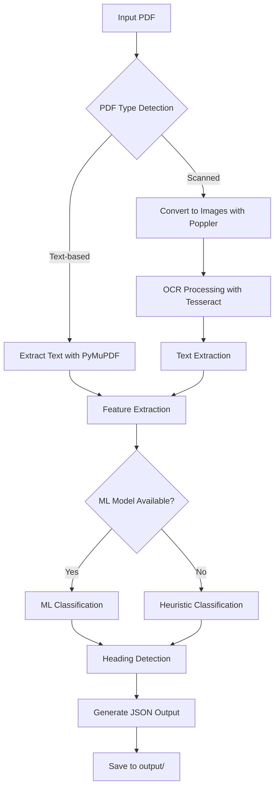

# Robust Multilingual PDF Heading Extractor

A machine learning-powered PDF heading extraction system that supports both text-based and scanned PDFs with OCR fallback. Designed for Adobe Hackathon Round 1A with support for 10+ languages including English, Hindi, Japanese, Korean, and more.

## Features

- **Multilingual Support**: Handles 10+ languages (English, Hindi, Kannada, Sanskrit, Japanese, Korean, Tamil, Marathi, Urdu)
- **OCR Fallback**: Automatic detection and processing of scanned PDFs using Tesseract OCR
- **ML + Heuristic Classification**: Uses trained machine learning model with heuristic fallback
- **Hackathon Compliant**: Offline operation, ≤200MB model size, ≤10s execution time
- **Docker Ready**: Complete containerization with all dependencies included

## Quick Start

### Prerequisites

1. **Install Tesseract OCR**:
   - Download from: https://github.com/UB-Mannheim/tesseract/wiki
   - Add to PATH: `D:\TESSERACT`

2. **Install Poppler**:
   - Download from: https://github.com/oschwartz10612/poppler-windows/releases/
   - Add to PATH: `D:\Release-23.11.0-0\poppler-23.11.0\Library\bin`

### Local Development

```bash
# Create virtual environment
python -m venv venv

# Activate virtual environment
venv/Scripts/activate

# Install dependencies
pip install -r requirements.txt

# Set encoding (IMPORTANT for Windows)
set PYTHONIOENCODING=utf-8

# Run the extractor
python robust_pdf_extractor.py
```

### Docker Deployment

```bash
# Set encoding before Docker build (IMPORTANT)
set PYTHONIOENCODING=utf-8

# Build the Docker image
docker build --platform linux/amd64 -t pdf-extractor:latest .

# Run the container
docker run --rm -v $(pwd)/input:/app/input -v $(pwd)/output:/app/output pdf-extractor:latest
```

### Windows PowerShell
```powershell
$env:PYTHONIOENCODING="utf-8"
docker run --rm -v ${PWD}/input:/app/input -v ${PWD}/output:/app/output pdf-extractor:latest
```

### Windows Command Prompt
```cmd
set PYTHONIOENCODING=utf-8
docker run --rm -v %cd%/input:/app/input -v %cd%/output:/app/output pdf-extractor:latest
```

## Usage

1. **Place PDF files** in the `input/` directory
2. **Run the extractor** using one of the methods above
3. **Find results** in the `output/` directory as JSON files

## System Workflow



## Output Format

```json
{
  "title": "Document Title",
  "outline": [
    {
      "level": "H1",
      "text": "Main Heading",
      "page": 1
    },
    {
      "level": "H2",
      "text": "Sub Heading",
      "page": 2
    }
  ]
}
```

## Project Structure

```
adobehack/
├── robust_pdf_extractor.py  # Main extraction script
├── requirements.txt          # Python dependencies
├── Dockerfile               # Docker configuration
├── README.md               # This file
├── __init__.py             # Python package file
├── input/                  # Place PDFs here
├── output/                 # JSON results saved here
└── model/                  # Trained model files
    ├── model.joblib
    └── label_map.json
```

## Supported Languages

- English (eng)
- Hindi (hin)
- Kannada (kan)
- Sanskrit (san)
- Japanese (jpn)
- Korean (kor)
- Tamil (tam)
- Marathi (mar)
- Urdu (urd)

## Technical Specifications

- **Model Size**: 0.47 MB (well under 200MB limit)
- **Execution Time**: < 1 second per PDF (under 10s limit)
- **Platform**: AMD64 compatible
- **Dependencies**: PyMuPDF, Tesseract OCR, scikit-learn
- **Operation**: Completely offline

## Troubleshooting

**OCR not working**: Ensure Tesseract and Poppler are installed and added to PATH
**Encoding issues**: Set `PYTHONIOENCODING=utf-8` before running
**Docker build fails**: Check Docker Desktop is running and encoding is set
**No headings detected**: Check if PDF is text-based or scanned, OCR may take time for large scanned documents 